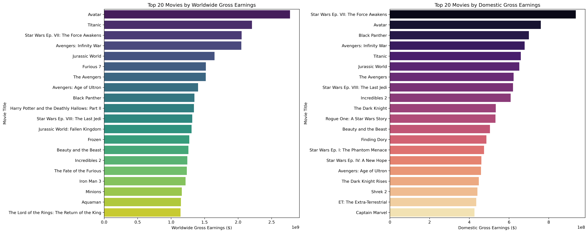
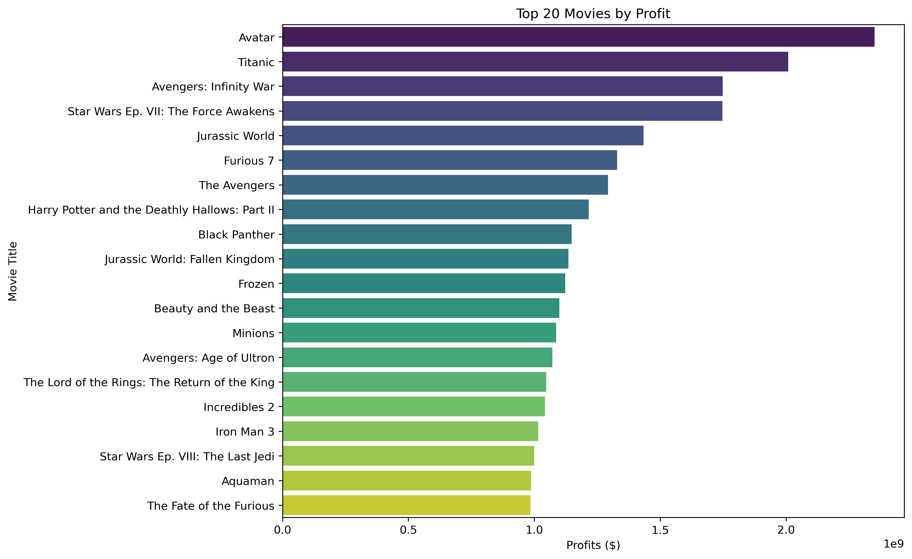
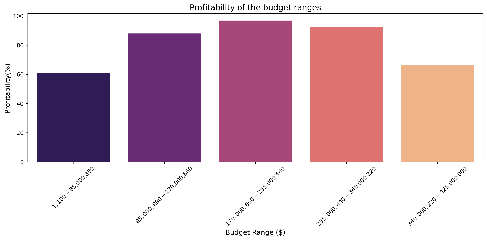
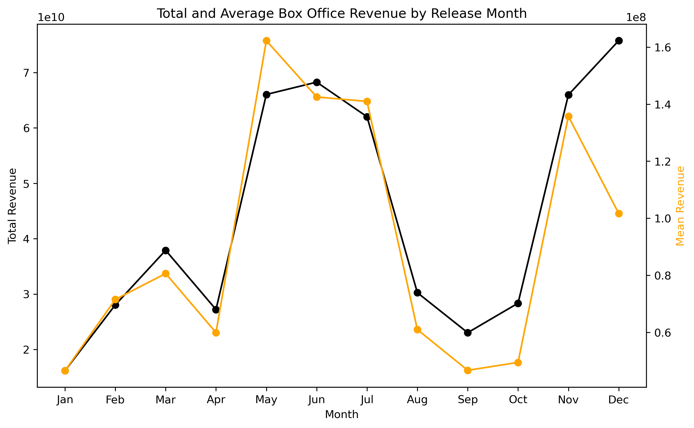
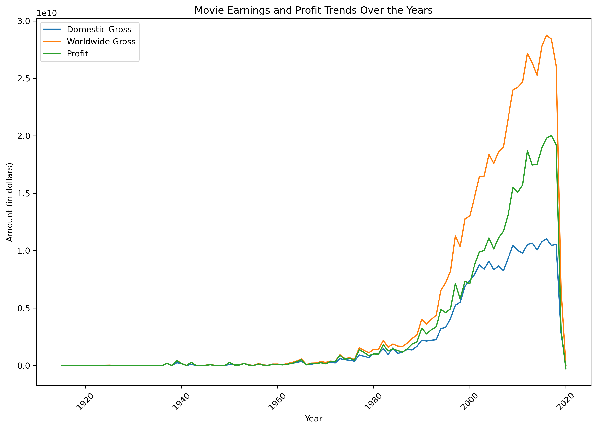

# <h1 style="text-align: center;">Movie Analysis: Identifying the Top Performing Film Types </h1>

## Project Overview
This project involves conducting an in-depth analysis aimed at generating actionable insights for stakeholders in the movie business. The analysis will explore various aspects of the movie industry, including financial performance, audience reception, and market trends. Our goal is to equip stakeholders with a comprehensive understanding of key metrics and trends, enabling them to make informed decisions that drive the company's growth and success in the competitive movie market.

## Business Understanding

### Defining The Question
Your company now sees all the big companies creating original video content and they want to get in on the fun. They have decided to create a new movie studio, but they don’t know anything about creating movies. You are charged with exploring what types of films are currently doing the best at the box office. You must then translate those findings into actionable insights that the head of your company's new movie studio can use to help decide what type of films to create.

##### **Problem Statement/Objective :** *Determine which types of films are currently doing the best at the box office and translate the findings into actionable insights.*

**Objectives:**
1. Identify types of films that are performing the best.
2. Explore and analyze current box office trends.
3. Identify factors that  contribute to the success of a movie.
4. Translate findings into actionable insights.

## Data understanding
For the analysis,we used data from the `zippedData` folder of [this repository.](https://github.com/learn-co-curriculum/dsc-phase-2-project-v3)

1. **bom.movie_gross.csv**: Contains financial information about movies.

2. **rt.movie_info.tsv**: Details about various movies.

3. **rt.reviews.tsv**: Contains movie reviews and ratings.

4. **tmdb.movies.csv**: Information about movies from The Movie Database (TMDb).

5. **tn.movie_budgets.csv**: Contains financial details about movies.

6.  **im.db**: im.db is a database that contains  8 tables, in this project we used movie basic and movie ratingsas represented in the ERD diagram below.

 

**Properties of Variables of interest:**

1. ***Movie Name:*** Categorical variable which is a textual label or name of the movie.
2. ***Genre:*** Categorical variable representing the type or category of the movie (e.g., Action, Drama, Comedy).
3. ***Budget:*** Continuous variable representing the production cost or budget of the movie.
4. ***Worldwide Gross:*** Continuous variable representing the total revenue generated by the movie at the box office.
5. ***User Rating:*** Continuous variable representing the average ratings or scores given by users for the movie.
6. ***Release Date:*** Temporal variable indicating the date when the movie was released in theaters.

## Results
The top 20 movies based on box office revenue are as shown: 

The top 20 movies with highest profit returns are as shown:

The data suggests that as the budget increases, profitability generally increases, peaking in the $170000660 -
$255,000,440 range. However, beyond this peak, the profitability decreases slightly, indicating diminishing returns on investment for higher budget ranges.

Therefore, the optimal budget range is 170,000,660 - 255,000,440 .

From the above graph, we notice that while May, November and December have the highest revenues, on average, May, June and July are the highest performing.

Over time, we notice `domestic_gross`, `worldwide_gross` and `profit` have been generally increasing. 

## . Findings and Conclusions
1. What types of films are currently performing best at the box office (based on box office gross)?

The top 5 movies by worldwide gross are Avatar, Titanic, Star Wars Ep. VII: The Force Awakens, Avengers: Infinity War and Jurassic World.

The best performing movie overall is Avatar. 
2. Which movie genres have been the most popular and successful over time?

3. How does the movie budget impact box office revenue, and can smaller budget films be profitable?

There is a correlation co-efficient of approximately 0.75 between production_budget and worldwide gross.
This indicates a strong positive linear correlation between the movie's production budget and its worldwide gross revenue.
The optimal budget range is between 
255,000,440 with a profitability index of 96.88%
4. Are there seasonal trends in movie performance, and when is the best time to release a movie?

May has the highest average worldwide gross earnings, followed by June and then July.
These months could be considered the best time to release a movie for maximum revenue as they generate the highest worldwide gross revenue on average.
Type Markdown and LaTeX: 

## . Recommendations
1. The top most profitable movies are action, adventure, Animation, Comedy, Drama, 'Fantasy, Horror, Romance, Sci-Fi, and Thriller we would advise the stakeholders to focus on these genres.
2. The top 5 most popular movies are all from the action genre so we would recommend the stakeholders focus more on action genres
3. Target production budgets to be within the optimal budget range to maximize on profitability.
4. Plan the release of movies to fall in the months of May, June, July, November, and December.

## Future Recommendation
ince our model is not accurate and we have a lot of variables that are not explained by the model we recommend further investigation and research of the data for better understanding

 